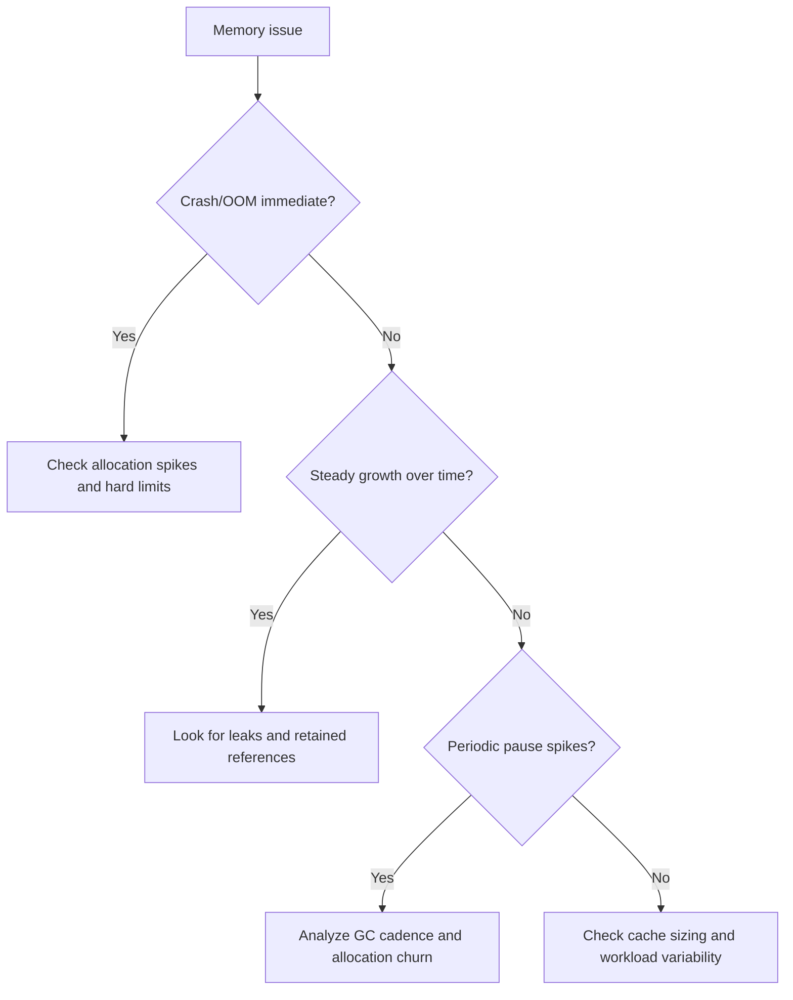

# Memory Debugging Playbook

Use this when memory grows over time, GC pauses spike, or process crashes/OOM.

## Stack vs Heap Symptoms
- Stack issues:
  - deep recursion crashes
  - immediate failure on specific call depth
- Heap issues:
  - gradual growth
  - periodic GC spikes
  - eventual OOM

## Leak Patterns to Watch
- Detached DOM retained by listeners.
- Global caches without eviction.
- Closures capturing large object graphs.
- Native-side handles not released.

## Profiling Workflow (Conceptual)
1. Define reproduction scenario and duration.
2. Capture baseline heap snapshot.
3. Repeat scenario N times.
4. Capture second snapshot.
5. Compare retained objects and reference paths.
6. Remove one suspected retention path.
7. Re-run and verify trend change.

## C/C++ Pitfalls in Engine-Style Code
- Missing ownership boundaries for allocated objects.
- Dangling pointers after free/move.
- Reference cycles in intrusive structures.
- Unbounded per-frame allocations.
- Incorrect root marking for GC-managed objects.

## Quick Triage Tree

## Checklist
- [ ] Reproduced memory behavior with fixed scenario.
- [ ] Captured before/after snapshots.
- [ ] Identified top retained paths.
- [ ] Verified one leak fix with repeated run.
- [ ] Logged GC pause trend before/after.

## Before/After Rules
- Keep scenario length and event sequence identical.
- Compare total retained size and top dominators.
- Validate no functional regressions from cleanup changes.
