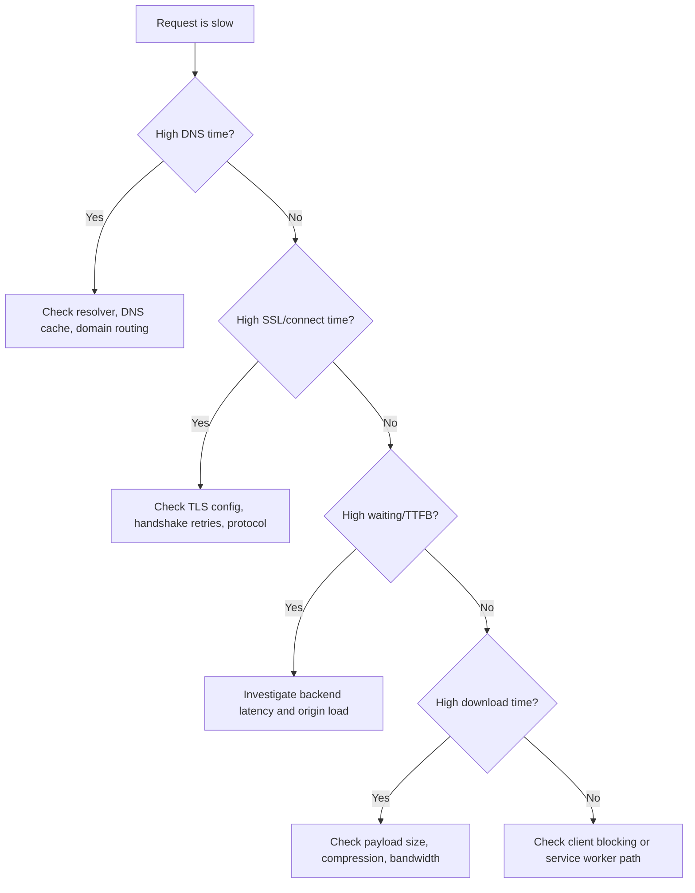

# Network Debugging Playbook

Use this when requests are slow, inconsistent, or failing.

## Step-by-Step Workflow

### Step 1: Reproduce Under Controlled Conditions
- Capture exact URL, method, payload, and environment.
- Disable noisy extensions and keep a stable network profile.

### Step 2: Inspect Chrome Network Panel
1. Open DevTools -> Network.
2. Reload with recording on.
3. Sort by duration and inspect top offenders.
4. Check timing phases:
   - DNS
   - Initial connection
   - SSL
   - Request sent
   - Waiting (TTFB)
   - Content download
5. Verify protocol (h1/h2/h3), response headers, cache headers.

### Step 3: Validate Caching Behavior
- Confirm `Cache-Control`, `ETag`, and `Age` behavior.
- Check whether response is served from memory/disk cache.
- If service worker exists, verify interception path in Application panel.

### Step 4: Packet-Level Validation (tcpdump/Wireshark)
- Capture traffic during reproduction window.
- Verify handshake sequence and retransmissions.
- Check for TLS handshake retries or certificate issues.
- Correlate packet timestamps with app logs.

### Step 5: Hypothesis and Targeted Fix
- Is latency from network path, server TTFB, or client-side blocking?
- Apply one fix at a time.
- Re-measure with same profile.

## Common Issues
- DNS misconfiguration or slow resolver.
- TLS handshake overhead spikes.
- Slow TTFB from backend or origin saturation.
- Caching confusion (unexpected misses or stale resources).
- Connection reuse disabled accidentally.

## Quick Triage Tree

## Checklist
- [ ] Reproduced issue with stable test profile.
- [ ] Captured Network panel timing breakdown.
- [ ] Validated cache headers and actual cache hits.
- [ ] Captured packet trace for failing run.
- [ ] Correlated trace with server/client logs.
- [ ] Tested one fix and measured before/after.

## Before/After Measurement Rules
- Same URL and payload.
- Same device and throttling profile.
- At least 5 runs each.
- Report median and p95.
