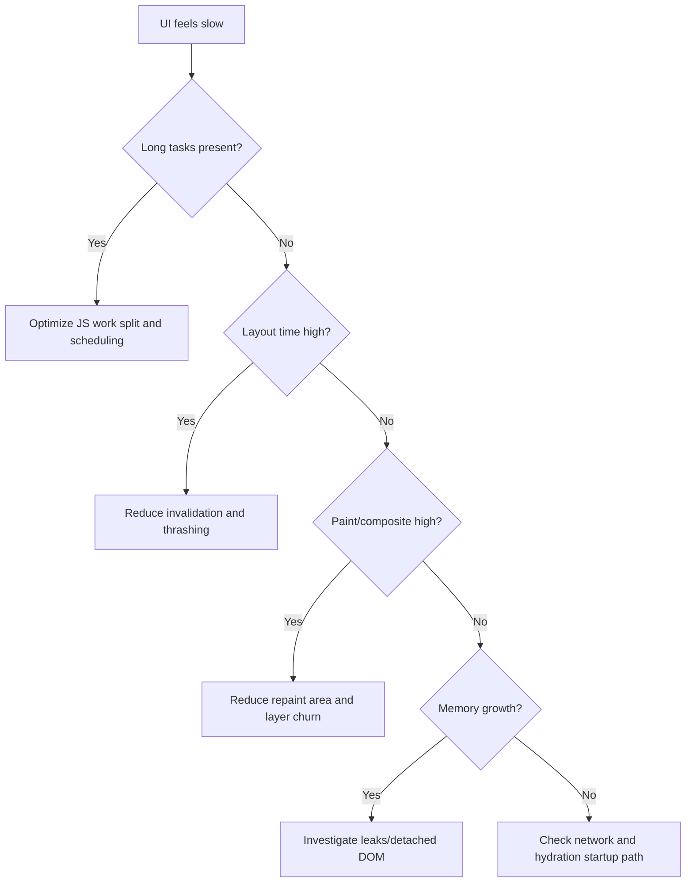

# Performance Debugging Playbook

Use this when the app feels janky, slow to interact, or slow to render.

## Step-by-Step Workflow

### Step 1: Baseline
- Record LCP, CLS, and INP/FID.
- Record one page load trace and one interaction trace.

### Step 2: Chrome Performance Panel
1. Open DevTools -> Performance.
2. Record target interaction/load.
3. Identify long tasks (>50ms).
4. Inspect main-thread categories:
   - scripting
   - rendering
   - painting
5. Mark top 3 cost centers.

### Step 3: Identify Known Patterns
- Forced reflow: layout reads after writes.
- Layout thrashing: repeated read/write alternation.
- Paint storms: too much repaint area or frequency.
- Long JS tasks blocking input handling.

### Step 4: Memory Panel Basics
- Take heap snapshot before/after repeated interaction.
- Check detached DOM and retained object growth.
- Validate whether leaks or cache overgrowth exist.

### Step 5: Fix and Validate
- Change one variable.
- Re-run same trace scenario.
- Compare metrics with baseline.

## Quick Triage Tree

## Checklist
- [ ] Baseline metrics captured.
- [ ] Load and interaction traces recorded.
- [ ] Top 3 bottlenecks identified with evidence.
- [ ] Fix applied to one bottleneck at a time.
- [ ] Before/after metrics captured under same conditions.
- [ ] Regressions checked.

## Before/After Measurement Rules
- Keep device/network profile identical.
- Run at least 5 trials.
- Compare median and p95.
- Include screenshots/traces for top findings.
