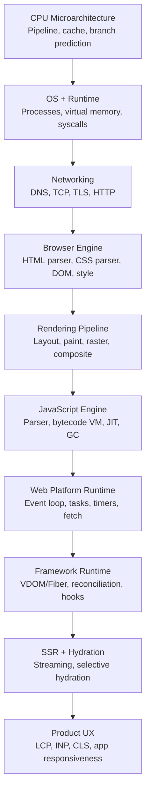

# Architecture Map: CPU to Browser

This map shows the full stack you are building through this course and how each layer appears in real frontend work.

## Full Stack Diagram

## Weeks Mapped to the Stack

## Layer-by-Layer Explanation

### 1. CPU and Memory
What you learn:
- Why branch misprediction, cache misses, and memory access patterns shape runtime speed.

How it shows up in frontend:
- JS execution stalls, GC pause behavior, and layout loops all inherit these costs.

### 2. OS and Runtime
What you learn:
- Syscalls, virtual memory, process model.

How it shows up in frontend:
- Browser process models, sandboxing, I/O behavior, and resource limits.

### 3. Networking
What you learn:
- TCP/TLS/HTTP transport behavior and debugging.

How it shows up in frontend:
- TTFB, retries, connection reuse, CDN and cache performance.

### 4. Browser Engine
What you learn:
- Parsing HTML/CSS and building style and layout structures.

How it shows up in frontend:
- Why some CSS is cheap and other CSS causes expensive invalidation.

### 5. Rendering Pipeline
What you learn:
- Layout, paint, and compositing internals.

How it shows up in frontend:
- Jank, scroll stutter, paint storms, animation smoothness.

### 6. JavaScript Engine
What you learn:
- Parsing, bytecode, optimization, GC, event loop.

How it shows up in frontend:
- Input latency, long tasks, memory growth, runtime cliffs.

### 7. Framework Runtime
What you learn:
- Reconciliation, scheduling, hooks semantics.

How it shows up in frontend:
- Re-render cost, commit spikes, state update behavior.

### 8. SSR and Hydration
What you learn:
- Streaming output and client bootstrapping mechanics.

How it shows up in frontend:
- Faster first render vs hydration CPU cost tradeoffs.

## Build Artifacts by Layer
- CPU/OS: microbench + profiling notes.
- Network: tiny HTTP server.
- Browser engine: parser/layout/paint mini pipeline.
- JS runtime: VM + event loop + GC basics.
- Framework: mini React runtime.
- Performance: measurable case study and before/after metrics.

## Related Reading
- [docs/what-happens-when-you-type-a-url.md](what-happens-when-you-type-a-url.md)
- [docs/frontend-systems-thinking.md](frontend-systems-thinking.md)
- [progress/checklist.md](../progress/checklist.md)
