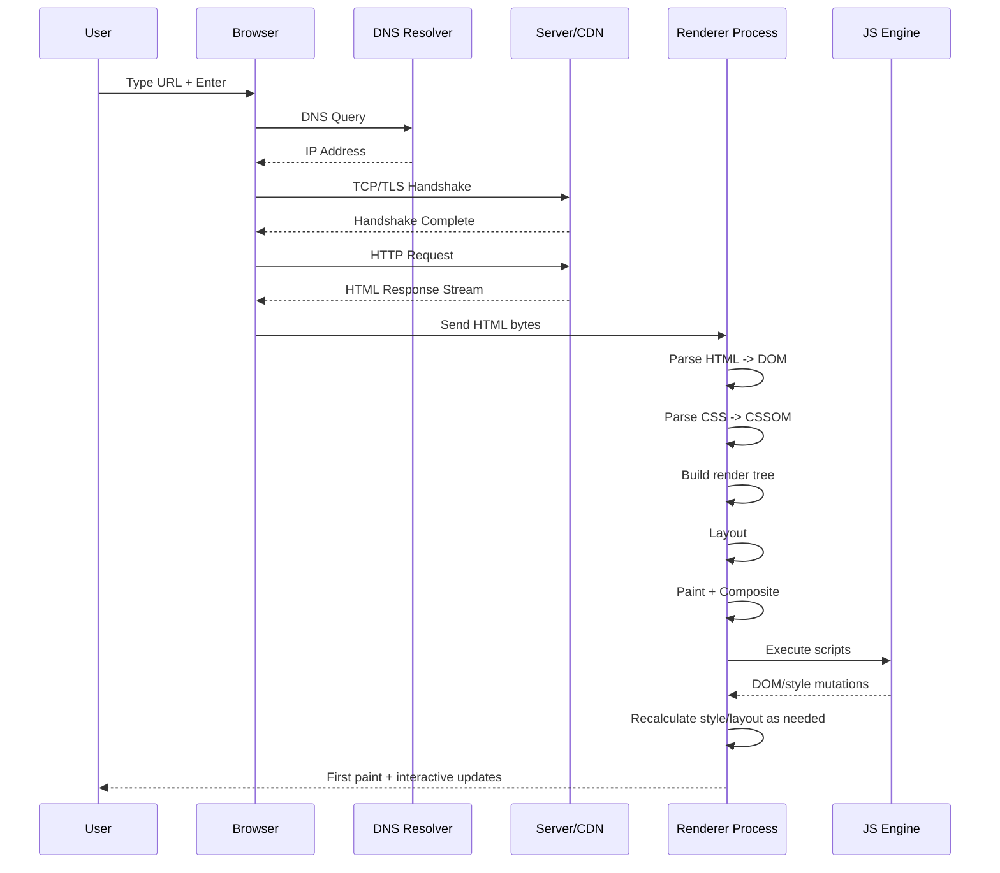

# What Happens When You Type a URL

This is the end-to-end path from browser address bar input to interactive UI.

## Network Pipeline (Request Acquisition)
1. URL parse and scheme selection.
2. DNS resolution (cache, resolver, authoritative path).
3. TCP handshake (or QUIC for HTTP/3).
4. TLS handshake and certificate verification.
5. HTTP request dispatch.
6. Cache checks (memory/disk/service worker/CDN/proxy layers).
7. Response stream starts.

## Rendering Pipeline (Response to Pixels)
1. HTML tokenization -> DOM tree.
2. CSS parse -> CSSOM.
3. DOM + CSSOM -> render tree.
4. Style calculation and invalidation.
5. Layout (geometry computation).
6. Paint list creation.
7. Rasterization and compositing.

## JavaScript Runtime Impact
- Script execution can block parse/layout depending on timing.
- Event loop order affects when work runs (microtasks vs macrotasks).
- Long tasks delay rendering and input handling.

## Sequence Diagram: Network + Rendering

## Debugging Checklist in Chrome DevTools

### Network Panel
- Verify DNS/connect/SSL/request timing breakdown.
- Check status codes, redirects, protocol (h1/h2/h3).
- Check cache headers (`Cache-Control`, `ETag`, `Age`).
- Inspect blocking and queueing time.

### Performance Panel
- Record page load and first interaction.
- Locate long tasks > 50ms.
- Inspect main-thread breakdown (scripting/layout/paint).
- Check for forced synchronous layout.

### Rendering Tools
- Enable paint flashing to detect repaint storms.
- Enable layer borders to inspect compositing behavior.

### Memory Panel
- Capture heap snapshots after repeated navigation.
- Check detached DOM nodes and retained object growth.

### Application Panel
- Validate service worker behavior and cache storage.
- Inspect local/session storage and IndexedDB impacts.

## Fast Triage (5-Minute)
1. Is network slow (TTFB/high connection cost) or CPU slow (long tasks)?
2. Is rendering bottleneck in layout or paint?
3. Is JS causing repeated sync style/layout reads?
4. Is hydration/main-thread startup the dominant cost?
5. Capture before/after metrics before changing code.

## Related Playbooks
- [debugging/network-debugging.md](../debugging/network-debugging.md)
- [debugging/perf-debugging.md](../debugging/perf-debugging.md)
- [case-studies/hydration-cost.md](../case-studies/hydration-cost.md)
