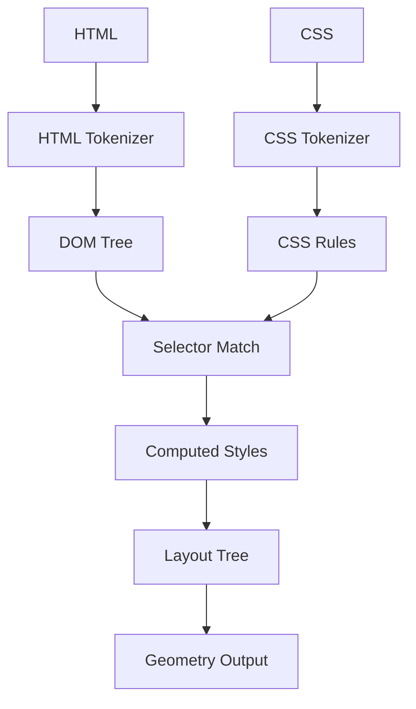

# Rendering Pipeline Mapping

This project maps directly to the browser rendering pipeline.

## Stage Mapping
1. HTML bytes -> tokenizer -> DOM
2. CSS bytes -> tokenizer -> rules
3. DOM + rules -> matched selectors
4. cascade -> computed style
5. computed style -> layout boxes

## Diagram

## Validation Suggestions
- Snapshot each stage output as JSON/text.
- Diff snapshots after each refactor.
- Keep failing snapshots as regression tests.
