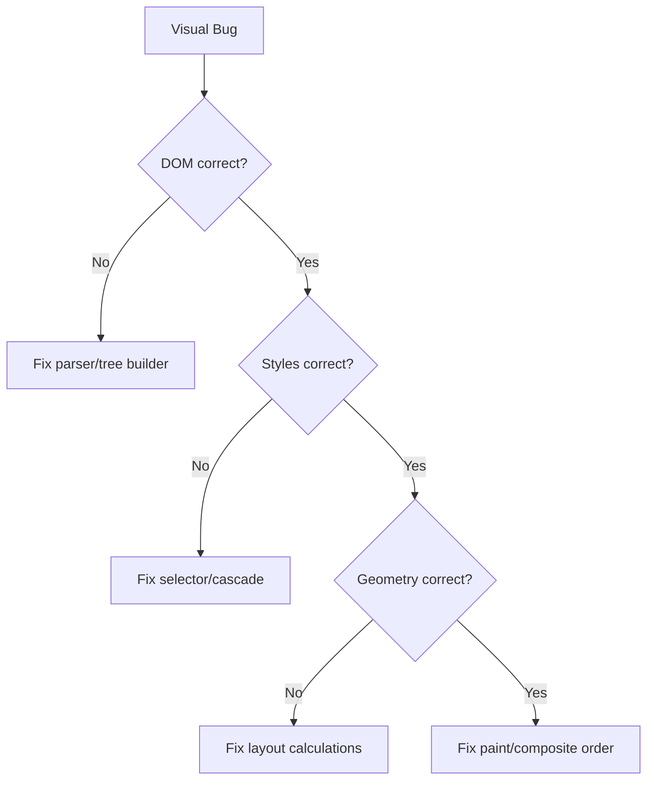

# Mini Browser Debugging Workflow

## Stage-by-Stage Debugging Strategy
1. Freeze one failing input document.
2. Dump each stage output.
3. Find first stage where output diverges from expected.
4. Fix and add regression test.

## Common Failure Classes
- Parse tree shape mismatch.
- Incorrect selector match and cascade winner.
- Wrong layout width/height due to box-model errors.
- Paint order bugs (z-order/stacking confusion).

## Tooling
- Snapshot files for DOM/style/layout/paint.
- Time each stage with scoped timers.
- Use differential comparison between revisions.

## Quick Triage Tree

